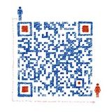

## Hexo 小书

之前折腾过 Hexo，  
花了一些时间，  
改了一个 Hexo 主题：[Hexo-theme-light_cn](https://github.com/pengloo53/Hexo-theme-light_cn)，  
获得一些人的喜欢，  
创建了一个 Hexo 的简书专题：[Hexo 简书](https://www.jianshu.com/c/7fafdc0abb5b)
写了一些关于 Hexo 的文章，  
于是，就有了这本的小书，  
只是至今尚未完成。

### 关于我

个人微信公众号：个人学习，专注分享：个人成长、读书感悟以及产品技术主题。

### 联系我

个人微信号，请务必备注信息「Hexo」。

