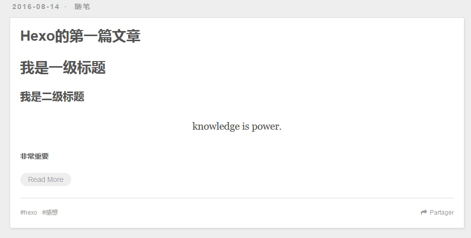

# 第一篇文章

> 不要因为走得太远，而忘了当初为什么要出发。

搭建博客的目的是为了写文章，是为了记下从脑海中一闪而过的思想，是为了捕捉工作生活中的灵感，是为了去记录生活的轨迹，亦或是为了分享知识，帮忙他人，总之，需要你去写，去总结生活或者工作中的种种。开始在自己的博客上写自己的第一篇文章吧。

- 切换到自己的博客目录，`cd Blog`;
- 新建一篇文章，使用`hexo new`命令或者直接将写好的文章*（.md文件）*放到`source/_post`目录下；
- 申明文章`Front-matter`，在文章的最开头加上如下类似的内容，例如：
   
    ```
    title: Hexo的第一篇文章
    date: 2016-08-14
    categories: 随笔
    tags: [hexo,感想]
    ---
    ```

- 写完`Front-matter`，接下来就用markdown基本语法写属于你的第一篇文章吧。

    ```
    title: Hexo的第一篇文章
    date: 2016-08-14
    categories: 随笔
    tags: [hexo,感想]
    ---

    # 我是一级标题     <h1></h1>
    
    ## 我是二级标题
    
    > knowledge is power.

    **非常重要**
<!-- more -->
    *我是斜体*
    
    1. 我是列表1
    2. 我是列表2
    3. 我是列表3
    
    
    - 我是无序
    - 我是无序
    
    [我是百度](http://www.baidu.com)
    ```

在文章中插入`<!-- more -->`，代表首页只显示插入它之前的文章内容，表示为摘要。


