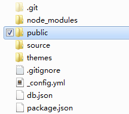

# 部署至Web服务器
写完文章，接下来就来发布它，知识重在分享。在本地上查看没有问题之后，那么就可以将博客项目部署到公网服务器上，这样大家才能访问到你的博客。这里讲述如何将静态页面部署到Web服务器上。

Web服务器首选[Nginx](http://nginx.org)，因为Hexo生成的是静态页面，使用Nginx做Web转发性能杠杠的。特别是在内网搭建个Blog平台啥的，找台没用的电脑，随便就能搭建高性能Web网站，虽然只是静态的，但是还是很炫的。

> 如果自己拥有服务器（或云服务器，或自己的主机），通过这种方法来部署，应该是最合适的。

## 1. 安装Nginx
安装非常简单，从[官方站点页面](http://nginx.org/en/download.html)下载Nginx软件包。下载完成后，直接解压到本地目录就行了。

打开`cmd`，进入Nginx目录，执行命令`start nginx`，然后你就可以在任务管理器中看到nginx的进程了。直接访问浏览器`http://127.0.0.1`，正常情况下，就能看到Nginx的欢迎界面了。如果不对，90%的可能是因为80端口占用问题，打开配置Nginx配置文件，修改一下默认端口就行了。

## 2. 配置静态页面
Nginx目录下打开`conf/nginx.conf`文件，部分内容如下：
    
```
...
server {
    listen       8080;
    server_name  127.0.0.1;
    location / {
        root   html;
        index  index.html;
}
...
```

如上，将默认`80`改成`8080`，然后在访问`http://127.0.0.1:8080`就OK了。下面`location`就是欢迎页面的访问路径，进入Nginx目录下`html`目录，可以看到有个`index.html`文件，这就是欢迎页面。

那么如何将Hexo静态站点部署在Nginx服务器下呢？

## 3. 部署静态站点
通过`Hexo g`命令生成的静态站点，默认就是Hexo站点目录中的`public`文件夹。



将生成好的静态站点（也就是`public/`目录），拷贝至Nginx目录下的`html`文件夹中。然后修改Nginx配置文件。

```
...
server {
    listen       8080;
    server_name  127.0.0.1;
    location / {
        root   html/public;
        index  index.html;
}
...
```

只是修改了`root`字段为`public`目录，其他地方都不变，然后重新加载Nginx，打开`cmd`，在Nginx目录下执行`nginx -s reload`，重新访问`http://127.0.0.1:8080`，就可以看到Hexo静态站点了。**在调试页面的时候要注意浏览器缓存的问题**

