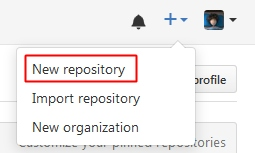
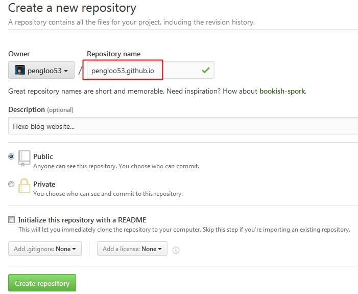

# [Github](https://github.com) or [Coding](https://coding.net) 托管
上节是有服务器的方法，当然没有服务器也有没有服务器的部署办法，那就是托管到别人的服务器上。

> 这种方法应该是最普遍，使用最广泛的方式了，目前提供这种服务（Page服务）并且使用最多的就数Github以及Coding两家了。

这里以[Github](https://github.com)为例来具体介绍一下详细操作方法。或直接看官方文档[GitHub Pages](https://pages.github.com/)更合适。

首先，申请Github账号，新建一个名为*username*.github.io的项目；

然后，回到本机生成SSH Key与Github进行密钥认证；
