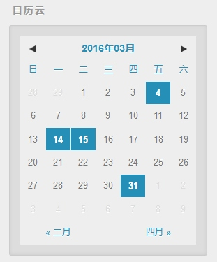

# 添加日历云挂件
这是个比较实用的小挂件，类似于归档的功能。之前[一篇文章](http://lupeng.me/2016/05/11/Hexo%E6%B7%BB%E5%8A%A0%E6%97%A5%E5%8E%86%E4%BA%91.html)介绍过它，这里再旧文重谈一遍。

在这个主题下的最终显示效果如图所示：



> 这里使用的是净土大哥开发的小插件，然后「厚颜无耻」的移植到了自己的博客里，下面就教大家如何主题中自定义这个小挂件。

## 1. 安装`hexo-generator-calendar`插件
安装插件很简单，在Hexo博客目录下，输入下面一条命令即可。

```bash
npm install --save git://github.com/howiefh/hexo-generator-calendar.git
```

这个小模块的作用是在你`hexo g`的时候，同时生成一个包含文章日期信息的`json`文件，你可以在`public`目录下找到这个文件，就是`calendar.json`文件。

## 2. 添加相关文件
这个日历小挂件是通过`js`来实现的，首先添加两个`js`文件，放在主题目录下`source/js/`目录下，点击下面链接可以查看。

- [landscape-x/calendar.js](https://github.com/pengloo53/landscape-x/blob/master/source/js/calendar.js)
- [landscape-x/languages.js](https://github.com/pengloo53/landscape-x/blob/master/source/js/languages.js)

添加完`js`文件后，需要在页面中引用，打开`layout/_partial/after-footer.ejs`文件，添加下面一段代码引用到页面中。

```html
<!-- calendar widget -->
<% if (theme.widgets.indexOf('calendar') != -1){ %>
  <script src="<%- config.root %>js/calendar.js"></script>
  <script src="<%- config.root %>js/languages.js"></script>
  <script type="text/javascript">
    $(function() {
    <% if (theme.calendar.options){ %>
      $('#calendar').aCalendar('<%= theme.calendar.language %>', $.extend(<%- JSON.stringify(theme.calendar.options ) %>, {single:<%= theme.calendar.single %>, root:'<%= theme.calendar.root %>'});
    <% }else{ %>
      $('#calendar').aCalendar('<%= theme.calendar.language %>',{single:<%= theme.calendar.single %>, root:'<%= theme.calendar.root %>'});
    <% } %>
    });
  </script>
<% } %>
```

然后添加一个日历挂件的样式文件`calendar.styl`，保存在主题目录下`source/css/_partial/`目录下，点击下面链接查看。

- [landscape-x/calendar.styl](https://github.com/pengloo53/landscape-x/blob/master/source/css/_partial/calendar.styl)

添加完样式文件`calendar.styl`后，需要在`source/css/style.styl`文件中引用一下，添加下面一句代码：

```css
@import "_partial/calendar"
```

最后添加页面代码，以小挂件的形式展现，在`layout/_widget/`下新建`calendar.ejs`文件，添加代码如下；

```html
<div class="widget-wrap">
  <h3 class="widget-title">日历云</h3>
  <div class="widget">
    <div id="calendar"></div>
  </div>
</div>
```

## 3. 添加相关配置
添加完页面文件，样式文件等等之后，简单做下配置就完成了。打开主题配置文件`_config.yml`添加如下配置：

```
widgets:
- weixin
- calendar

# 日历云
calendar:
  language: zh-CN
```

一个是在`widgets`中添加`calendar`一项；一个是添加日历云的简单配置。