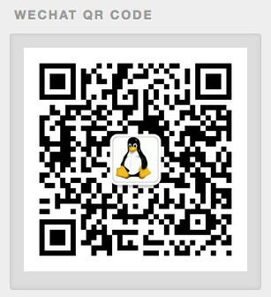

# 国际化（i18n）
有可能你会问`i18n`是个什么鬼？其实`i18n`==`internationalization`，取首尾字母，然后加上中间18个字母。

Hexo是支持多语言的，在主题目录下有`language`文件夹，定义了不同语言的配置文件。


默认主题里就定义了以上7种语言，默认使用的`default.yml`这个文件。想要修改成其他语言，在项目的配置文件中`_config.yml`修改下面这个字段。

```
...
language: zh-CN
...
```

然后重新执行命令`hexo g`生成页面即可。


如上图，那些使用了主题的语言配置文件的字段就按照配置文件中定义显示出来了。

当然我们也可以在配置文件中增加新的字段，例如我们想把微信那个修改成语言配置字段。首先在`language/zh-CN`中添加一条。

```
weixin: 微信二维码
```

然后在`language/default.yml`中添加一条。

```
weixin: Wechat QR Code
```

最后修改一下微信二维码小挂件的那个标题字段，打开`layout/_widget/weixin.ejs`文件，将`h3`中文本修改为：`<%= __('weixin') %>`，代码如下：

```html
<div class="widget-wrap">
  <h3 class="widget-title"><%= __('weixin') %></h3>
  <div class="widget">
    
  </div>
</div>
```

这样就可以，当切换语言环境的时候，这里的字段就会显示为语言配置文件中定义为`weixin`变量的那个值。假如现在我们切换成默认语言就可以看到。**注意：修改项目配置文件，需要重新执行`hexo g`命令，才能生效。**



之前添加的小挂件里定义的那些固定文本都可以通过这种方式修改成语言配置文件字段。