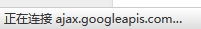

# 去Google化
这是个艰难的决定，Google的服务是非常赞的，但是对与国内用户来说，简单是太煎熬了，太影响访问速度了。

可能你早就发现页面打开后，一直在加载，如下图。


自己可以通过*科学上网*的方式来访问Google，但是不能要求所有访问你Blog站点的人都能*科学上网*吧，所以只能忍痛去掉它。

## 1. 替换jquery资源库地址
在主题目录下找到`after-footer.ejs`文件，**PS：主题目录指的是themes下landscape目录**

```
Blog
├── themes
    └──landscape
        └── layout
            └── _partial
                └── after-footer.ejs
```

找到下面一段代码

```
...
<script src="//ajax.googleapis.com/ajax/libs/jquery/2.0.3/jquery.min.js"></script>
...
```

修改为：（将jquery的在线地址修改为百度的静态资源库地址）

```
...
<script src="http://libs.baidu.com/jquery/2.1.1/jquery.min.js"></script>
...
```

修改完之后，刷新一下页面，再也没有转圈圈的等待了，是不是感觉爽了一些。

## 2. 删除Google分析代码
主题默认没有启用，删不删倒不影响，这里还是删掉它，顺便简要介绍一下为什么没有启用。

在同一个目录下，有这么个文件`google-analytics.ejs`，它就是Google分析的代码。

```
Blog
├── themes
    └──landscape
        └── layout
            └── _partial
                └── google-analytics.ejs
```

打开它，

```
<% if (theme.google_analytics){ %>
<!-- Google Analytics -->
<script type="text/javascript">
(function(i,s,o,g,r,a,m){i['GoogleAnalyticsObject']=r;i[r]=i[r]||function(){
(i[r].q=i[r].q||[]).push(arguments)},i[r].l=1*new Date();a=s.createElement(o),
m=s.getElementsByTagName(o)[0];a.async=1;a.src=g;m.parentNode.insertBefore(a,m)
})(window,document,'script','//www.google-analytics.com/analytics.js','ga');

ga('create', '<%= theme.google_analytics %>', 'auto');
ga('send', 'pageview');

</script>
<!-- End Google Analytics -->
<% } %>
```

第一行出现了一个判断语句，这是`ejs`模版引擎的语法，`theme.google_analytics`这个变量是在`theme`目录下`_config.yml`配置文件里定义的。

打开`_config.yml`（**注意：这里是主题目录下的配置文件**）

```
...
# Miscellaneous
google_analytics:
favicon: /favicon.png
...
```

这里默认值为空，即判断语句不成立，故页面上并不会展现google_analytics的这段代码。

好了，原理知道了，接下来就是删掉它，同时删掉`google-analytics.ejs`文件，最后去掉主题目录下`layout/_partial/head.ejs`文件中`  <%- partial('google-analytics') %>`这一句的引用就好了，整个世界清净了。

## 3. 替换Google fonts资源库
在主题目录下`layout/_partial/head.ejs`文件中找到下面一句代码：

```html
<link href="//fonts.googleapis.com/css?family=Source+Code+Pro" rel="stylesheet" type="text/css">
```

替换成如下代码：（360的资源库）

```html
<link href="//fonts.useso.com/css?family=Source+Code+Pro" rel="stylesheet" type="text/css">
```