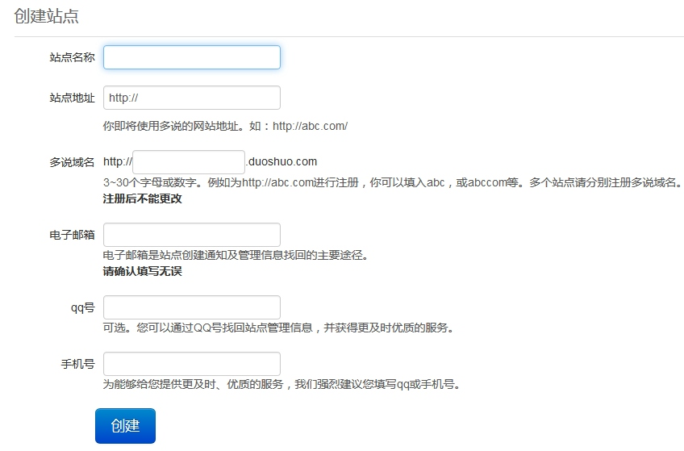
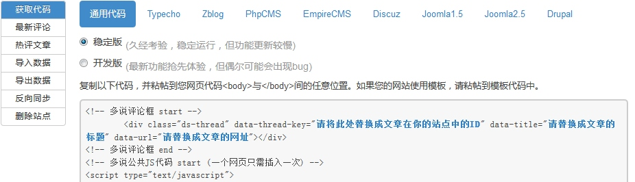
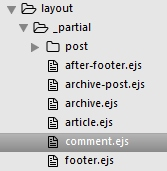
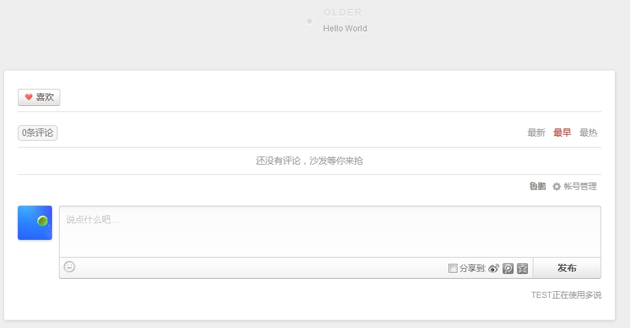
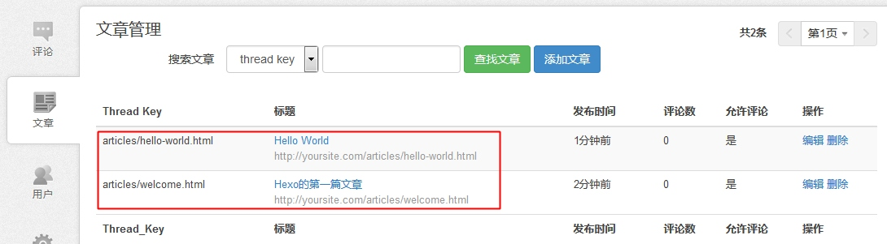

# 替换评论服务
`landscape`主题默认使用的评论服务是`disqus`，`disqus`的评论服务在国内也是可以访问的，但是鉴于速度问题，这里替换成国内的多说评论。

## 1. 删掉disqus评论
还是刚才那个`after-footer.ejs`文件，删掉如下代码：

```js
<% if (config.disqus_shortname){ %>
<script>
  var disqus_shortname = '<%= config.disqus_shortname %>';
  <% if (page.permalink){ %>
  var disqus_url = '<%= page.permalink %>';
  <% } %>
  (function(){
    var dsq = document.createElement('script');
    dsq.type = 'text/javascript';
    dsq.async = true;
    dsq.src = '//' + disqus_shortname + '.disqus.com/<% if (page.comments) { %>embed.js<% } else { %>count.js<% } %>';
    (document.getElementsByTagName('head')[0] || document.getElementsByTagName('body')[0]).appendChild(dsq);
  })();
</script>
<% } %>
```

## 2. 添加多说评论
[多说 - 社会化评论系统](http://duoshuo.com/)提供了多说评论框、最新评论以及热评文章等插件。
### 2.1 获取通用代码
首先登陆多说，创建一个站点，获取通用代码，如下图，






这里有4个地方需要注意填写：

- `data-thread-key` 填上`<%= page.path %>`，代表页面路径；
- `data-title` 填上`<%= page.title %>`，代表页面标题；
- `data-url` 填上`<%= page.permalink %>`，代表页面的完整网址；
- `short_name` 填上`<%= theme.duoshuo_short_name %>`注册多说账号的时候让你填的多说域名；

上面的`data-title`、`data-url`只是为了在多说的控制平台上更方便地控制，其实可以不填。但是`data-thread-key`肯定要区分开，不然多说就不知道评论在哪个页面上显示了，那可就乱了。

### 2.2 创建`comment.ejs`文件
在主题目录下`layout/_partial`文件夹下创建`comment.ejs`文件，用于存放多说评论代码片段；将上面代码拷贝到`comment.ejs`中，如图所示，



```html
<!-- 多说评论框 start -->
  <div class="ds-thread" data-thread-key="<%= page.path %>" data-title="<%= page.title %>" data-url="<%= page.permalink %>"></div>
<!-- 多说评论框 end -->
<!-- 多说公共JS代码 start (一个网页只需插入一次) -->
<script type="text/javascript">
var duoshuoQuery = {short_name:"<%= theme.duoshuo_short_name %>"};
  (function() {
    var ds = document.createElement('script');
    ds.type = 'text/javascript';ds.async = true;
    ds.src = (document.location.protocol == 'https:' ? 'https:' : 'http:') + '//static.duoshuo.com/embed.js';
    ds.charset = 'UTF-8';
    (document.getElementsByTagName('head')[0] 
     || document.getElementsByTagName('body')[0]).appendChild(ds);
  })();
  </script>
<!-- 多说公共JS代码 end -->
```

### 2.3 配置多说short_name
`short_name`是多说账号的唯一凭证，自己的评论系统使用自己的`short_name`，这里最好通过主题变量来控制，如果别人使用了你的主题，恰好没有改`short_name`，那么你的评论系统里就会出现别人文章的评论，这就有点乱了。

在主题目录下修改`_config.yml`文件，添加下面两行：

```
# duoshuo
duoshuo_short_name: lupeng-test
```

这样就行了，别人如果使用你的主题，就不用去代码里修改`short_name`里，直接在主题的配置文件里修改一下就可以了。

### 2.4 在文章页面中显示多说
上面的工作是把多说的代码以及配置全部搞定了，最后一步就是将它放到文章底部。先找到文章的那部分片段代码；

```
Blog
├── themes
    └──landscape
        └── layout
            └── _partial
                └── article.ejs
```

在`article.ejs`文件最后找到这段代码，

```
<% if (!index && post.comments && config.disqus_shortname){ %>
<section id="comments">
  <div id="disqus_thread">
    <noscript>Please enable JavaScript to view the <a href="//disqus.com/?ref_noscript">comments powered by Disqus.</a></noscript>
  </div>
</section>
<% } %>
```

修改成：

```
<% if (!index && post.comments && theme.duoshuo_short_name){ %>
<section id="comments">
  <%- partial('comment') %>
</section>
<% } %>
```

上面判断语句，首先判断非首页，启用文章评论，多说短域名已经配置，就会展现多说评论框。

下图就是展示的效果

进入多说后台管理界面，就会发现，出现了两篇文章，一篇是默认文章，一篇是咱们写第一篇文章。

    