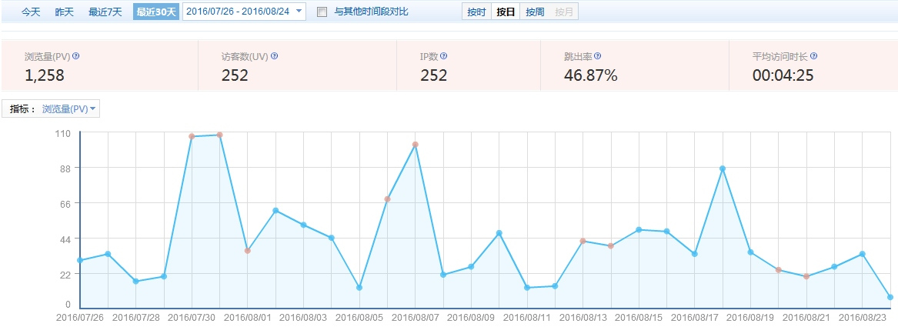
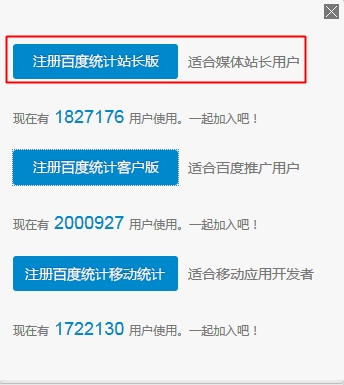
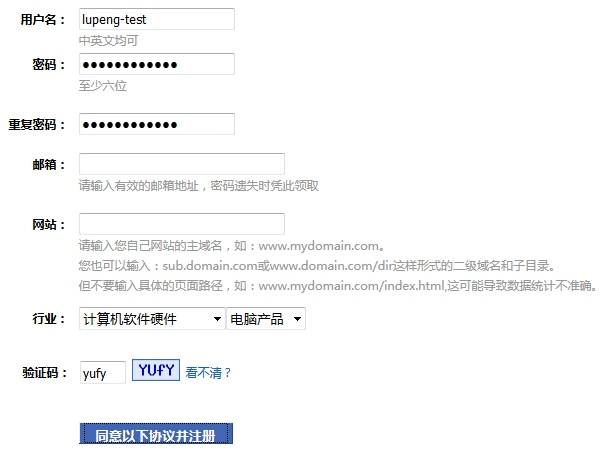
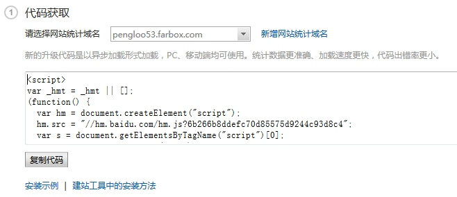

# 添加百度统计
通过百度统计可以看出站点的访问详情，统计出实时访客，每日PV，来源网站等等信息，便于做一些流量分析。下图是我博客站点`http://lupeng.me`的一些情况，看样子还是比较惨淡的，文章产出率不高，也没关注过SEO啥的。



好了，下面来添加一下百度统计代码到你的Hexo站点中。

首先要注册百度统计账号，这里以百度统计站长版为例。




注册完之后，就会出现代码获取界面，复制此处代码。



然后在主题目录下`layout/_partial`目录下新建`baidu_tongji.ejs`文件


将上面拷贝的代码添加到其中。

最后将百度统计的代码引入到页面中，由于这是一段`js`，为了不影响整体页面的加载速度，将它添加到`after-footer.ejs`文件中，在其中加上下句代码引入到页面中。

```
...
<%- partial('baidu_tongji') %>
...
```

这样就基本完成了。如果你想像多说评论那样，加一个「开关」，在主题配置文件中控制是否开启百度统计。

将`baidu_tongji.ejs`文件修改为：

```javascript
<% if(theme.baidu_tongji){ %>  
  <script>
  var _hmt = _hmt || [];
  (function() {
    var hm = document.createElement("script");
    hm.src = "//hm.baidu.com/hm.js?6b266b8ddefc70d85575d9244c93d8c4";
    var s = document.getElementsByTagName("script")[0]; 
    s.parentNode.insertBefore(hm, s);
  })();
  </script>
<% } %>
```

使用一个判断语句包含，然后在主题配置文件`_config.yml`中添加`baidu_tongji`这个变量即可。

```
# baidu_tongji
baidu_tongji: true
```

当该值填成`false`的时候，就是不开启百度统计。