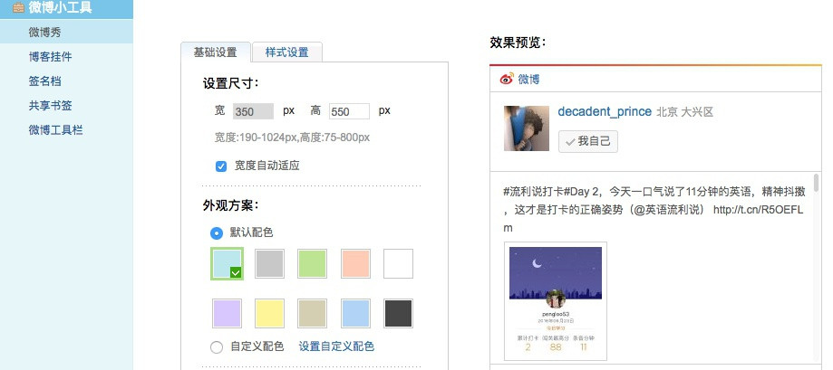
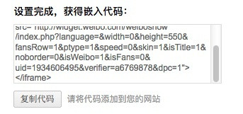

# 新浪微博挂件
在站点右侧添加新浪微博小挂件-[微博秀](http://app.weibo.com/tool/weiboshow)，登录新浪微博，打开微博秀定制页面，如下图



大致设置一下自己的样式，复制下面的嵌入代码。




因为要作为右侧小挂件显示出现，于是在主题目录下`layout/_widget`文件夹下新建`weibo.ejs`文件。

我们针对这段代码做一些配置变量，这里我们定义两个变量进行配置，一个是`height`，一个是`url`，那么那段嵌入代码就变成了:

```html
<iframe width="100%" height="<%= theme.weibo.height %>" class="share_self"  frameborder="0" scrolling="no" src="<%= theme.weibo.url %>"></iframe>
```

然后为了跟其他widget保持一致的样式做一些修饰，于是`weibo.ejs`代码就变成了：

```html
<div class="widget-wrap">
  <h3 class="widget-title">我的微博</h3>
  <div class="widget">
    <iframe width="100%" height="<%= theme.weibo.height %>" class="share_self"  frameborder="0" scrolling="no" src="<%= theme.weibo.url %>"></iframe>
  </div>
</div>
```

最后在主题配置文件`_config.yml`中添加如下配置即可。

```
# weibo
weibo:
    height: 600
    url: http://widget.weibo.com/weiboshow/index.php?language=&width=0&height=600&fansRow=1&ptype=1&speed=0&skin=1&isTitle=1&noborder=0&isWeibo=1&isFans=0&uid=1934606495&verifier=a6769878&dpc=1
```

细心的你可能也会发现，其实URL里那些属性值就是页面那些样式的设置，所以直接修改属性值，样式就自动变了。比如`fansRow`改成2就是指显示两排粉丝。

配置完之后，你可能发现为什么不也给微博小挂件加个「开关」呢，对于该主题，页面右侧的小挂件是可以通过主题配置来选择是否加载的，而不需要单独给`widget`加开关，主题配置文件`_config.yml`中有如下配置：

```
widgets:
- category
- tag
- tagcloud
- archive
- recent_posts
- weibo
```

最后加上weibo即可，注释掉就代表不加载，通过这个配置就可以实现「开关」功能了。