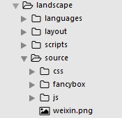

# 微信二维码挂件
添加完新浪微博挂件，相信你对添加`widget`有了一定了解，下面添加一个微信二维码挂件，同样分为以下几步：

## 1. 获取二维码图片
公众账号也好，个人微信也好，选择合适尺寸的图片，保存到主题目录下的`source`文件夹下。



## 2. 新建`weixin.ejs`文件
在主题目录下`layout/_widget`下新建`weixin.ejs`文件，编入如下代码：

```html
<div class="widget-wrap">
  <h3 class="widget-title">微信二维码</h3>
  <div class="widget">
    
  </div>
</div>
```

## 3. 在主题中配置该挂件
打开主题目录下`_config.yml`配置文件，找到如下代码：

```
widgets:
- weixin
- category
- tag
- tagcloud
- archive
- recent_posts
- weibo
```

这里将`weixin`加入到第一行，表示在页面右侧挂件中，显示在最上面，最终效果如下图。

