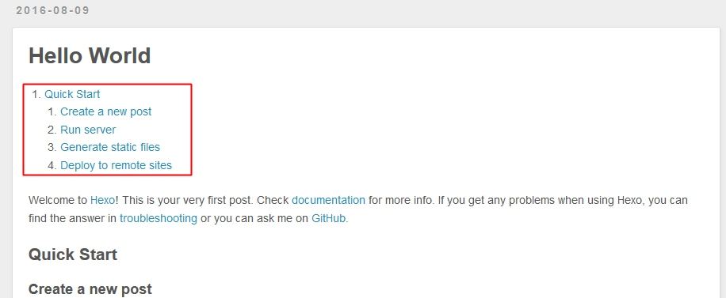
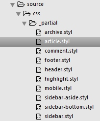
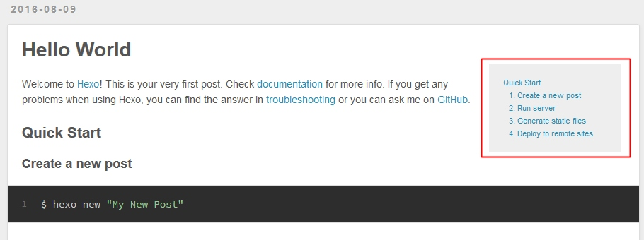

# 添加文章目录
根据文章的标题，显示文章的目录，这个应该也是比较基础的需求，所以Hexo在3.0版本中提供了辅助函数来实现这个功能，所以添加起来还是比较容易的。

## 1. 添加`toc.ejs`文件
在主题目录下`layout/_partial`文件夹中新建`toc.ejs`文件，存放文章目录的代码。

```html
<% if (post.toc != false) {%>
<div id="toc">
  <%- toc(post.content, {list_number: false}) %>
</div>
<% } %>
```

这里的`toc()`函数就是Hexo官方提供的辅助函数，不用再自行写这部分代码了，直接调用`toc()`函数即可，`post.content`代表该文章内容，`list_number: false`是函数提供的一个配置参数，这里指定`false`代表文章列表不默认显示序号。

同时这段代码添加了一个文章变量`toc`，当在文章`front-matter`里添加`toc: false`时，就表示该文章不想显示目录。这样便可以控制哪些文章显示目录，哪些文章不想显示目录。

## 2. 添加到页面中
文章目录应该显示在文章内容的页面，这里将它放到文章的开始部分，找到主题目录文章布局文件`layout/_partial/article.ejs`，找到下面代码：

```html
...
    <div class="article-entry" itemprop="articleBody">
      <% if (post.excerpt && index){ %>
        <%- post.excerpt %>
        <% if (theme.excerpt_link){ %>
          <p class="article-more-link">
            <a href="<%- url_for(post.path) %>#more"><%= theme.excerpt_link %></a>
          </p>
        <% } %>
      <% } else { %>
        <%- partial('toc') %>
        <%- post.content %>
      <% } %>
    </div>
...
```

可以看到，在`<%- post.content %>`前面添加了一行`<%- partial('toc') %>`引用了目录代码。现在刷新页面就可以看到目录了，如下图



## 3. 修改目录样式
上面也基本能满足文章目录的功能，只是不太好看，下面添加一些样式代码，让它看起来更美观一点。

在主题目录下`source/css/_partial`文件夹下找到`article.styl`文件，打开文件，在文件末端添加下面一段代码。




```css
#toc
  float right
  background-color #eee
  font-size 0.8em
  color color-link
  margin 5px
  .toc
    list-style none
```

重新刷新页面看看，如下图，看起来是不是美观了一些。




