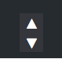

# 回到顶部按钮
这是个比较常用的功能，当文章特别长的时候，滑到底部，需要一个返回顶部的按钮帮助一键回到顶部，增强用户体验。

同样我们也分为下面几步来实现这个功能。

## 1. 新增`top.ejs`文件
在主题目录下`layout/_partial`文件夹中新建`top.ejs`文件，存放返回顶部小模块的代码。

```html
<div id="top">
    <a href="#">▲</a>
    <a href="#footer">▼</a>
</div>
```

## 2. 添加到页面中
回到顶部按钮一般要添加到页面的底部，于是打开主题目录下`layout/_partial/footer.ejs`文件，添加下面一句代码即可。

```
<%- partial('top') %>
```

## 3. 添加样式
打开主题目录下`source/css/_partial`的`footer.styl`文件，在最后添加如下代码。

```css
#top
  width 30px
  height 50px
  background rgba(85, 85, 85, 0.3) none repeat scroll 0% 0%
  position fixed
  bottom 1%
  right 3%
  text-align center
  cursor pointer
  a
    display block
    font-size 18px
    line-height 25px
    color #FFF
    text-decoration none
   a:hover
     background-color #258FB8
```

好了，回到顶部的基本功能就完成了，最终效果如下图所示。

