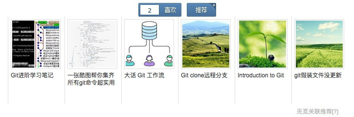
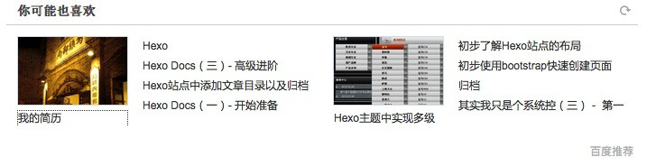
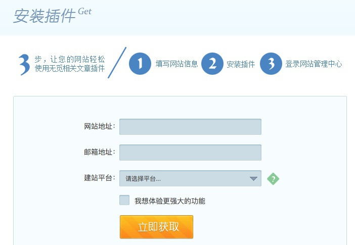
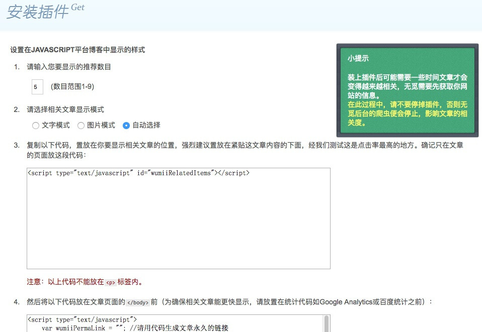
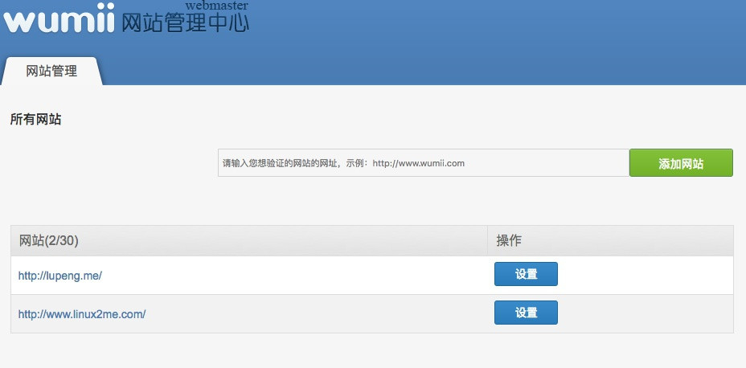
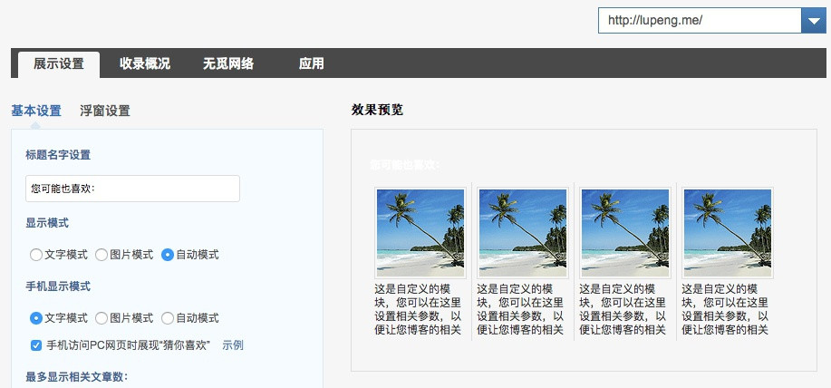
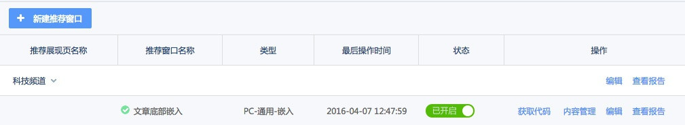
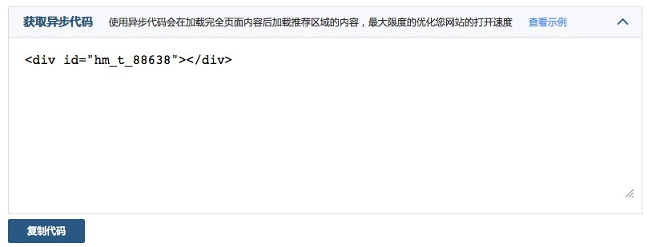

# 添加推荐模块
推荐模块指的就是文章底部显示该文章的关联推荐文章链接，例如下面是图灵社区中某篇文章的关联推荐模块，可以看到图灵社区使用的关联推荐模块是[无觅关联推荐](http://www.wumii.com/widget/relatedItems)；


除了无觅关联推荐还有百度推荐，如下图所示



这里我们把这两个推荐模块一起集成到主题中，可以通过配置来选择使用哪个推荐模块。

## 1. 获取无觅推荐代码
点击[无觅关联推荐](http://www.wumii.com/widget/relatedItems)，进入首页，注册账号，获取插件代码。
    




如需要自定义相关样式，可以进入无觅后台管理中心，进行自定义设置。



添加网站进入设置界面可以进行自定义设置，设置部分就不多说了。接下来看如何添加的站点中。



## 2. 获取百度推荐代码
进入[百度推荐 -- 最专业的个性推荐引擎](http://tuijian.baidu.com/rec-web/welcome/login)首页，注册，并新建一个推荐窗口，最终获取代码，中间过程就不多赘述了，按照网站提示往下走就行了。





这里我们选择异步代码，使推荐模块不影响网页页面的加载。

## 3. 新建推荐模块`relate.ejs`
在主题目录下`layout/_partial`文件夹下新建`relate.ejs`文件，存放推荐模块的相关代码，将从无觅推荐上以及百度推荐上获取的代码集成到这个推荐模块中，代码如下所示：

```js
<% 
    var tags = [];
    var categories = [];
    post.tags.forEach(function(tag){
        tags.push(tag.name);
    });
    post.categories.forEach(function(category){
        categories.push(category.name);
    });
 %>
<section id = "relate">
    <% if (theme.relate_provider == 'baidu_tuijian'){ %>
                <div id="<%= baidu_tuijian_id %>"></div>
    <% } else if(theme.relate_provider == 'wumii'){%>
                <script type="text/javascript" id="wumiiRelatedItems"></script>
                <script type="text/javascript">
                    var wumiiPermaLink = "<%= post.permalink %>"; //请用代码生成文章永久的链接
                    var wumiiTitle = "<%= post.title %>"; //请用代码生成文章标题
                    var wumiiTags = "<%- tags.join(',') %>"; //请用代码生成文章标签，以英文逗号分隔，如："标签1,标签2"
                    var wumiiCategories = <%- categories %>; //请用代码生成文章分类，分类名放在JSONArray中，如: ["分类1","分类2"]
                    var wumiiSitePrefix = "<%= theme.wumii_siteprefix %>";
                    var wumiiParams = "&num=6&mode=3&pf=JAVASCRIPT";
                </script>
    <% } %> 
</section>
```

为了让无觅推荐服务更加精准，上面添加了一段javascript代码用来获取`wumiiTags`以及`wumiiCategories`变量所需要的值。

同时，这里定义了一个`relate_provider`以及`wumii_siteprefix`变量，用来配置选择哪个推荐服务以及无觅推荐的域名，并且也定义了百度推荐变量`baidu_tuijian_id`，同样可以在主题配置文件下进行配置。

最后，无觅推荐还有一段在线`js`代码把它放到放到`after_footer.ejs`文件中，避免由于wumii的关系影响页面加载，如下所示

```html
<!-- wumii关联推荐 -->
<script type="text/javascript" src="http://widget.wumii.cn/ext/relatedItemsWidget"></script>
```

接下来就是在主题配置文件中对上述代码中的变量进行配置。

## 4. 在配置文件中添加相关配置
打开主题配置文件`_config.yml`,进行如下配置，写清楚注释文本，利人利己。

```
# relate
# 填写baidu_tuijian 或者 wumii ，如果不需要，不填即可
relate_provider: 
# 填写百度推荐提供的代码里的id，例如我的：hm_t_88638
baidu_tuijian_id: 
# 填写你的域名，例如我的：http://lupeng.me
wumii_siteprefix: 
```

## 5. 将推荐模块添加到文章中
上面只是新建了`relate.ejs`文件，还没有添加到实际页面中，接下来将它添加到文章页面下，也就是`layout/_partial/article.ejs`中，添加到如下位置上，即在文章页面显示。

```
...
<% if (!index){ %>
    <%- partial('post/nav') %>
    <%- partial('relate') %>
<% } %>
...
```

OK，大功告成，集成推荐模块完成，这里只能选其一，如果都要的话，就要修改一下`relate.ejs`文件了，不过不建议都要，不然会使页面看起来不够简洁。